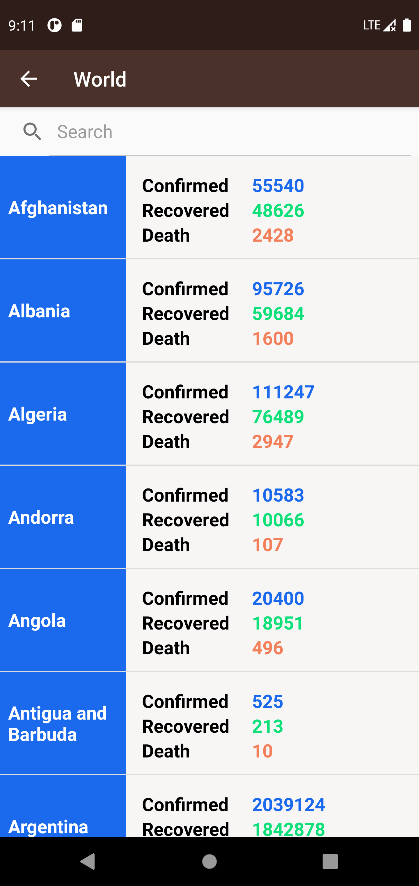

# COVnTech
COVnTech, an android app built to update people with the information about the current pandemic, the novel Coronavirus.
 
Data is directly fetched from the APIs and updated in the UI.
 
Concepts implemented in this project:
 
1. Custom Adapters
2. Custom Class
3. Fragments
4. Fragment Adapters
5. Activities
6. Intents
7. Networking
8. Custom Loaders
 
Look and feel of UI
 

 

 

 

 

 
